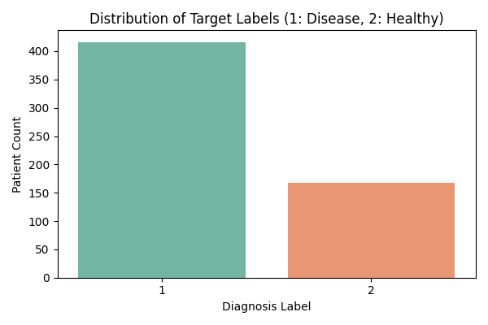
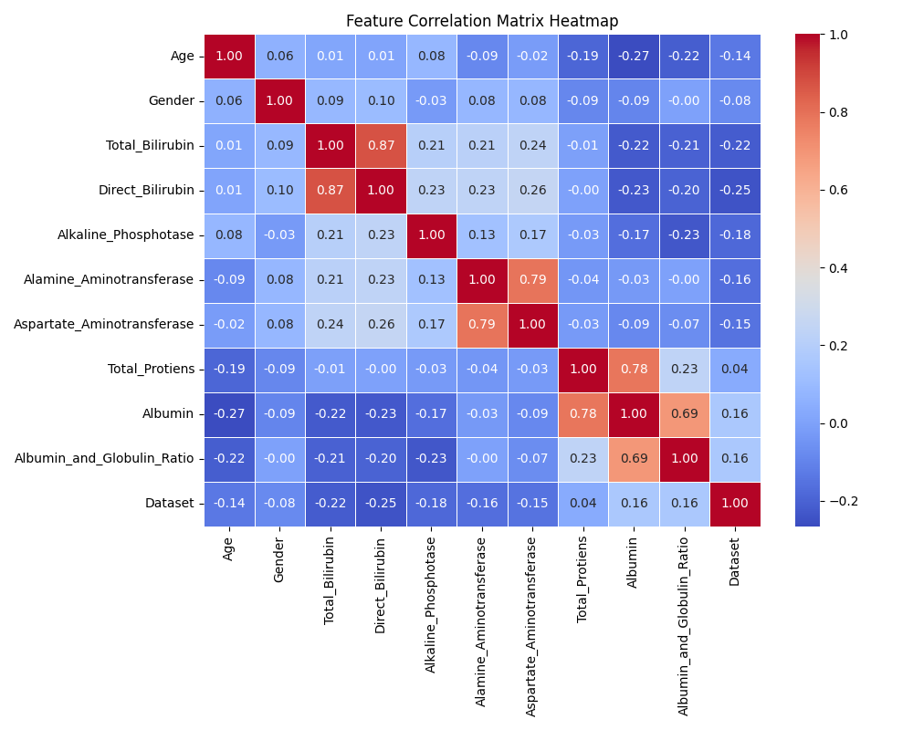
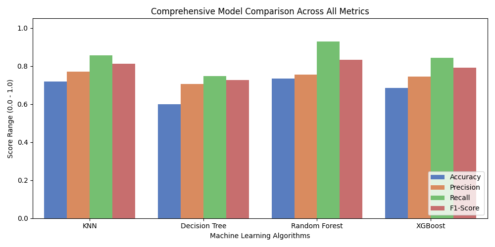
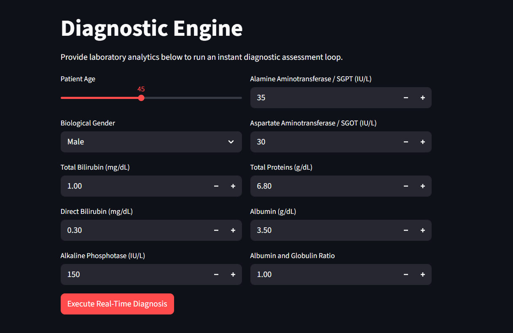
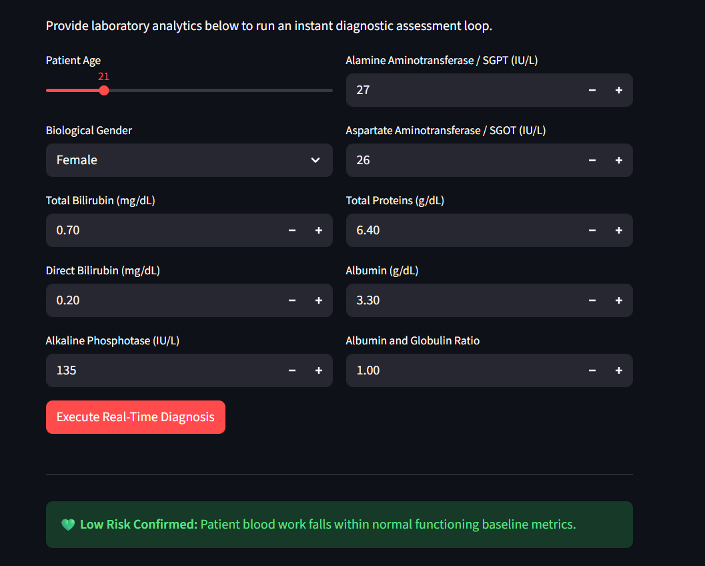
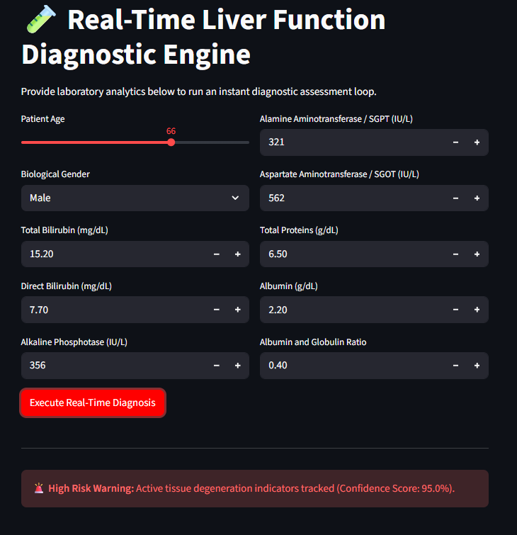

# 🩺 Liver Disease Risk Prediction System

A full-stack Machine Learning application designed to predict the likelihood of liver disease using patient clinical and biochemical health indicators.

This project implements an end-to-end Machine Learning workflow, including data preprocessing, exploratory data analysis (EDA), feature engineering, model training, model evaluation, REST API development, and real-time prediction through an interactive web interface.

The system is built using a FastAPI backend and Streamlit frontend, enabling users to obtain instant liver disease risk assessments from patient health data.

---

## 📌 Project Overview

Liver disease remains a major healthcare challenge worldwide. Early identification of high-risk patients can help support timely diagnosis and treatment decisions.

This project leverages Machine Learning techniques to analyze patient medical parameters and classify whether a patient is likely to have liver disease.

The complete workflow covers:

- Data Cleaning
- Exploratory Data Analysis (EDA)
- Feature Preprocessing
- Outlier Treatment
- Model Training
- Model Evaluation
- Model Comparison
- Backend API Development
- Frontend Deployment
- Real-Time Prediction

---

## 🎯 Objectives

- Predict liver disease risk using patient health indicators.
- Compare multiple machine learning algorithms.
- Identify the best-performing model.
- Build a scalable prediction API.
- Provide an easy-to-use web interface.
- Support early risk assessment through predictive analytics.

---

## 🏗️ System Architecture

```text
Patient Health Parameters
            │
            ▼
     Streamlit Frontend
            │
            ▼
      FastAPI Backend
            │
            ▼
   Trained ML Model
            │
            ▼
 Risk Prediction Result
            │
            ▼
Displayed to User
```

---

# 📂 Project Structure

```text
Liver-Disease-Risk-Assessment/
│
├── backend/
│   └── api.py
│
├── core/
│   ├── train.py
│   ├── best_liver_model.joblib
│   ├── production_scaler.joblib
│   ├── target_distribution.png
│   ├── correlation_matrix.png
│   └── model_comparison.png
│
├── data/
│   └── HealthCareData.csv
│
├── frontend/
│   └── app.py
│
├── requirements.txt
├── README.md
└── .gitignore
```

---

# 📊 Dataset Information

The dataset was provided through the SmartBridge internship program.

The dataset contains patient demographic information and liver-related clinical measurements used to classify liver disease risk.

### Features

- Age
- Gender
- Total Bilirubin
- Direct Bilirubin
- Alkaline Phosphotase
- Alamine Aminotransferase
- Aspartate Aminotransferase
- Total Proteins
- Albumin
- Albumin and Globulin Ratio

### Target Variable

| Value | Meaning |
|---------|---------|
| 1 | Liver Disease |
| 0 | Healthy |

---

# 🔬 Exploratory Data Analysis (EDA)

Exploratory Data Analysis was performed to understand data distribution, identify correlations, and inspect class balance before model development.

---

## Target Distribution Analysis

The target distribution chart shows the proportion of liver disease and healthy patients present in the dataset.

### Generated Visualization



### Insights

- Dataset contains both disease and healthy classes.
- Stratified train-test splitting was used to preserve class distribution.
- Understanding class balance helps ensure reliable model evaluation.

---

## Feature Correlation Analysis

A Pearson Correlation Heatmap was generated to identify relationships between features.

### Generated Visualization



### Insights

- Strong relationships exist among several biochemical indicators.
- Bilirubin-related features exhibit notable correlations.
- Correlation analysis helps understand feature interactions before training.

---

# ⚙️ Data Preprocessing Pipeline

The following preprocessing steps were applied before model training.

## 1. Missing Value Handling

Missing numerical values were replaced using Median Imputation.

```python
dataset[column].fillna(dataset[column].median())
```

---

## 2. Categorical Encoding

Gender values were converted into numerical form.

| Gender | Encoding |
|----------|----------|
| Male | 1 |
| Female | 0 |

---

## 3. Target Label Encoding

The original target labels were transformed into binary classes.

| Original Label | Encoded Label |
|----------------|--------------|
| Disease | 1 |
| Healthy | 0 |

---

## 4. Outlier Treatment

Outliers were handled using the Interquartile Range (IQR) method.

```text
Lower Bound = Q1 − 1.5 × IQR
Upper Bound = Q3 + 1.5 × IQR
```

Values outside these boundaries were clipped.

---

## 5. Feature Scaling

Standardization was applied using StandardScaler.

```python
scaler = StandardScaler()
```

The fitted scaler was saved for deployment.

---

# 🤖 Machine Learning Models Evaluated

Four machine learning algorithms were trained and evaluated.

| Model | Accuracy | Precision | Recall | F1 Score |
|---------|---------|---------|---------|---------|
| KNN | 71.79% | 77.17% | 85.54% | 81.14% |
| Decision Tree | 59.83% | 70.45% | 74.70% | 72.51% |
| Random Forest | 73.50% | 75.49% | 92.77% | 83.24% |
| XGBoost | 68.38% | 74.47% | 84.34% | 79.10% |

---

## Model Comparison Visualization



---

# 🏆 Selected Production Model

## Random Forest Classifier

The Random Forest model was selected as the final deployment model after comparing all four algorithms.

### Performance Highlights

- Highest Accuracy: **73.50%**
- Highest Recall: **92.77%**
- Highest F1-Score: **83.24%**

### Why Random Forest?

Random Forest achieved the strongest overall performance across the evaluation metrics.

The model successfully identified approximately 93 out of every 100 liver disease cases, making it highly effective for risk prediction and screening applications.

Its strong balance between Accuracy, Recall, and F1-Score made it the most reliable model for deployment.

---

# 🚀 Deployment Architecture

The application follows a decoupled architecture:

### Backend

- FastAPI
- REST API Endpoint
- Model Loading
- Prediction Service

### Frontend

- Streamlit
- User Input Forms
- Real-Time Prediction Interface

### Model Persistence

- Joblib
- Saved Scaler
- Saved Trained Model

---

# 🖥️ Application Demonstration

## Home Interface





---

## Prediction Example – Low Risk





---

## Prediction Example – High Risk





---

# 🛠️ Technologies Used

### Programming Language

- Python

### Machine Learning

- Scikit-Learn
- XGBoost

### Data Analysis

- Pandas
- NumPy

### Visualization

- Matplotlib
- Seaborn

### Backend

- FastAPI
- Uvicorn

### Frontend

- Streamlit

### Model Serialization

- Joblib

---

# ▶️ Running the Project Locally

## Clone Repository

```bash
git clone https://github.com/DurgaDevi335/Liver-Disease-Risk-Assessment.git

cd Liver-Disease-Risk-Assessment
```

## Install Dependencies

```bash
pip install -r requirements.txt
```

## Train Model

```bash
cd core

python train.py
```

## Start Backend

```bash
cd backend

uvicorn api:app --reload
```

API Documentation:

```text
http://127.0.0.1:8000/docs
```

## Launch Frontend

```bash
cd frontend

streamlit run app.py
```

Application URL:

```text
http://localhost:8501
```

---

# 🔮 Future Enhancements

- Hyperparameter Tuning
- Explainable AI using SHAP
- Docker Containerization
- Cloud Deployment
- CI/CD Integration
- Automated Model Retraining

---

# 👩‍💻 Author

**Durga Devi Ravipati**

B.Tech – Computer Science and Engineering (Cyber Security)

GitHub:
https://github.com/DurgaDevi335

LinkedIn:
https://www.linkedin.com/in/durga-devi-ravipati

---

# ⚠️ Disclaimer

This project is developed for educational and research purposes. The predictions generated by the system should not be considered medical advice or a substitute for professional diagnosis.
